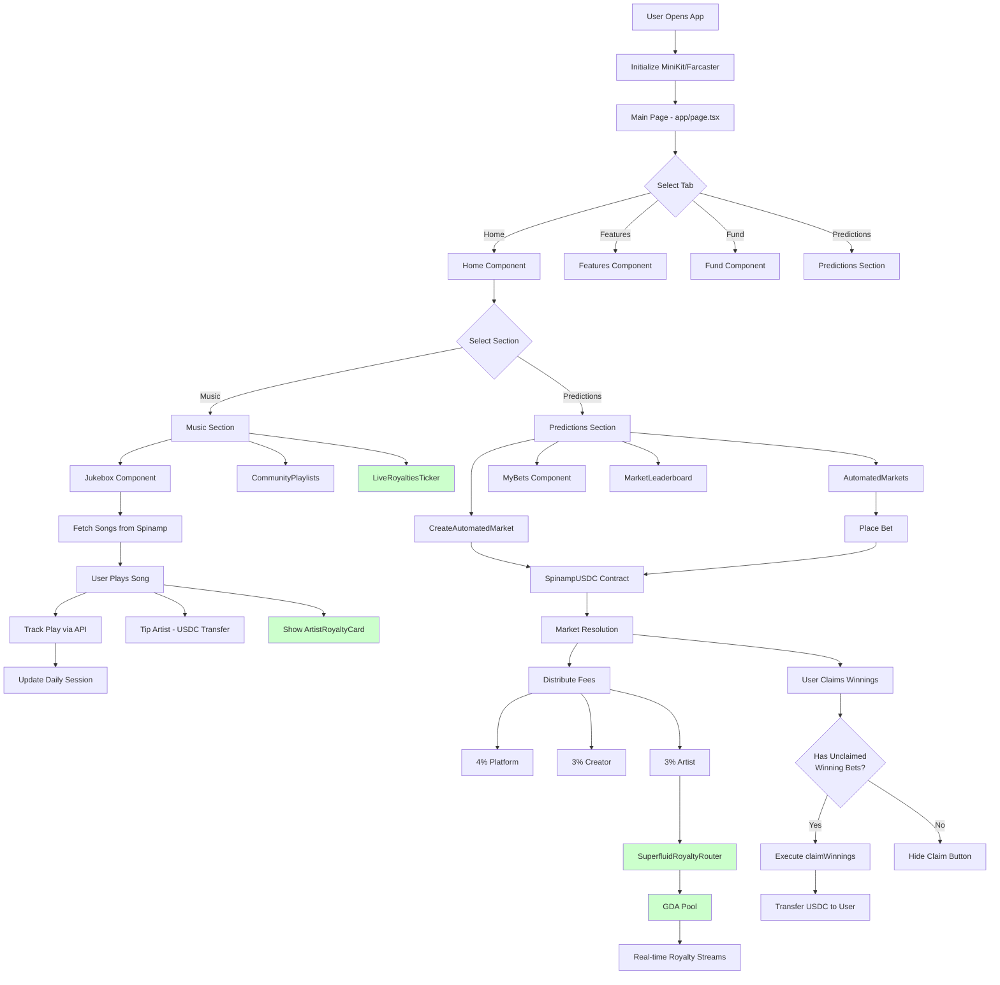

# Jukebox Application Flow Documentation

## Overview

This document describes the complete application flow for the Jukebox music streaming and prediction market platform.

## Application Architecture



## Component Flow

### Music Section Flow

1. **User opens Music section**
   - `Home.tsx` renders Music section
   - `LiveRoyaltiesTicker` displays real-time royalty flow
   - `Jukebox` component loads songs from Spinamp API

2. **User plays a song**
   - Song metadata fetched from Spinamp
   - Play event tracked via `/api/plays/track`
   - Daily session updated in Redis
   - Audio player initialized

3. **User tips artist**
   - USDC transfer initiated via wagmi
   - Transaction sent to blockchain
   - Tip recorded in database

4. **Royalty display**
   - `ArtistRoyaltyCard` shows artist-specific royalties
   - Real-time flow rate displayed
   - Pool breakdown shown if available

### Prediction Market Flow

1. **Market Creation**
   - User creates market via `CreateAutomatedMarket`
   - Contract call to `createMarket()`
   - Market stored on-chain with resolution time

2. **Placing Bets**
   - User selects track and amount
   - Bet placed via `placeBet()` contract function
   - USDC transferred to contract
   - Bet stored in `marketBets` mapping

3. **Market Resolution**
   - Chainlink Automation triggers resolution
   - Chainlink Functions fetches winning track
   - Fees distributed (4% platform, 3% creator, 3% artist)
   - Artist fees routed to Superfluid pool

4. **Claiming Winnings**
   - User views resolved markets in `AutomatedMarkets` or `MyBets`
   - System checks if user has unclaimed winning bets
   - Claim button shown only if eligible
   - User clicks claim → `claimWinnings()` executed
   - USDC transferred to user's wallet

## Data Flow

### Superfluid Royalties

```
Market Resolution
  ↓
Artist Fee (3%)
  ↓
SuperfluidRoyaltyRouter
  ↓
GDA Pool Creation/Update
  ↓
Real-time Streaming
  ↓
Artist Receives USDC/second
```

### Bet Claim Flow

```
Resolved Market
  ↓
Check User Bets
  ↓
Filter Winning Bets
  ↓
Check Claim Status
  ↓
Calculate Payout
  ↓
Transfer USDC
```

## API Endpoints

### Music
- `GET /api/plays/track` - Track play events
- `GET /api/superfluid/royalties/live` - Live royalty data
- `GET /api/superfluid/royalties/live?artist={address}` - Artist royalties

### Predictions
- `GET /api/prediction/markets` - Active markets
- `GET /api/prediction/markets/{id}` - Market details
- `GET /api/prediction/users/{address}/bets` - User bets
- `POST /api/prediction/resolve` - Resolve market (admin)

## State Management

- **Music Context**: Global audio player state
- **Wallet Context**: Wallet connection state
- **Theme Context**: UI theme preferences
- **React Query**: API data caching and refetching

## Key Features

1. **Real-time Royalties**: Superfluid GDA pools stream USDC to artists
2. **Prediction Markets**: Weekly automated markets with Chainlink resolution
3. **Play-to-Earn**: (Deferred to future phase)
4. **Community Playlists**: Shared music discovery
5. **Direct Tipping**: USDC transfers to artists

